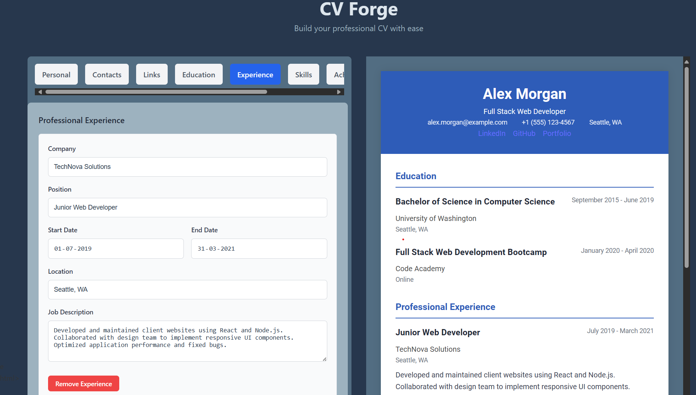
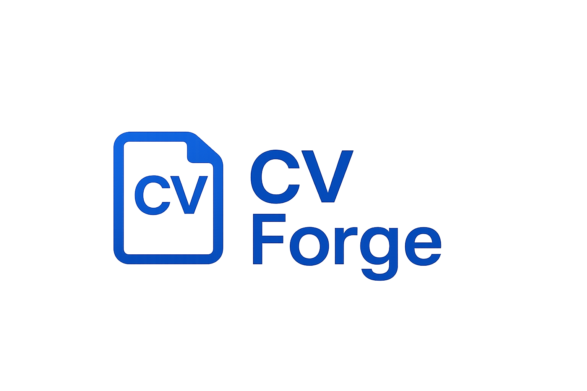

# CV Forge

A dynamic CV and résumé generator built with React. Users can input and edit personal, educational, and professional details, then instantly view a formatted version. Export your CV as a professional PDF with customizable styling options!

## Live Demo

🚀 [**View Live Demo: CV Forge**](https://cv-forge-site.netlify.app/)

## Features

- ✨ Complete personal information input forms
- 🎓 Education section with multiple entries
- 💼 Work experience tracking with details
- 🔗 Links and social media profiles
- 🏆 Achievements and certifications
- 🛠️ Skills section with proficiency levels
- 👀 Live CV preview as you type
- 🎨 Customizable themes and fonts
- 🖨️ Export to PDF functionality
- 💾 Data persistence with localStorage
- 🔄 Sample data templates
- 📱 Fully responsive design

## Tech Stack

- React 18
- Vite (Build tool)
- CSS3 (with CSS variables for theming)
- JavaScript ES6+
- html2pdf.js (PDF generation)
- Local Storage API

## Getting Started

### Prerequisites

- Node.js (v14.0.0 or higher)
- npm or yarn

### Installation

\`\`\`bash
# Clone the repository
git clone https://github.com/singharyan006/cv-forge.git
cd cv-forge

# Install dependencies
npm install

# Start the development server
npm run dev
\`\`\`

Open [http://localhost:5173](http://localhost:5173) to view it in the browser.

## Project Structure

\`\`\`
src/
├── assets/          # Static assets like images
├── components/      # React components
│   ├── forms/       # Form input components
│   ├── preview/     # CV preview components
│   └── settings/    # Settings and customization components
├── hooks/           # Custom React hooks
├── utils/           # Utility functions
│   ├── dataUtils.js # Data management utilities
│   ├── pdfUtils.js  # PDF generation functions
│   └── localStorage.js # Local storage helpers
├── styles/          # CSS files
├── data/            # Sample data
├── App.jsx          # Main App component
├── App.css          # App styles
├── main.jsx         # React entry point
└── index.css        # Global styles
\`\`\`

## Key Features Explained

### CV Forms

The application includes comprehensive forms for all aspects of your CV:
- Personal details (name, title)
- Contact information
- Education history
- Work experience
- Skills with proficiency levels
- Achievements and certifications
- Social links and profiles

### Live Preview

As you fill in the forms, the CV preview updates in real-time, allowing you to see exactly how your final CV will look.

### Customization Options

Customize your CV with:
- Different font families
- Color themes
- Paper size options for PDF export
- Margin settings

### PDF Export

Generate a professional PDF of your CV with a single click, ready to send to employers.

### Data Persistence

Your CV data is automatically saved to your browser's localStorage, ensuring you never lose your work.

### Sample Data

Get started quickly with sample CV data that demonstrates how to effectively use each section.

## Future Enhancements

- 📄 Multiple CV templates to choose from
- 🌙 Dark/Light mode toggle
- 🔠 Additional font options
- 🔄 Import/Export data in JSON format
- 📤 Direct sharing to social platforms
- 👥 Multi-language support
- 📊 Analytics on CV completeness
- ✅ Spell check and writing suggestions

## The Odin Project

This project is part of The Odin Project curriculum, focusing on React state management and component architecture.

## License

This project is licensed under the MIT License - see the [LICENSE](LICENSE) file for details.

## Acknowledgments

- The Odin Project community for inspiration and guidance
- All contributors to this project

## Preview

## Deployment

This project is deployed on Netlify. Visit the live application at [cv-forge-site.netlify.app](https://cv-forge-site.netlify.app/).

---

Looking to contribute? See our [Contributing Guide](CONTRIBUTING.md) for details.
